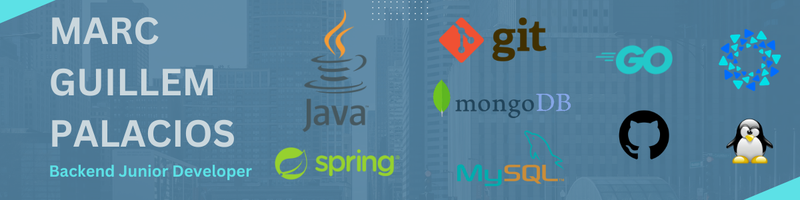

# 👋 Hi, I'm Marc Guillem Palacios

**Desarrollador Backend Junior | Java & Spring Boot**

---

##  About Me

I'm currently specializing in Backend Development at IT Academy, focusing on Java and Spring technologies. My passion for computers started when I was very young, but I decided to pursue formal training just recently. I am a strong enthusiast of free software and open source—believing that sharing and collaboration are the keys to real motivation and meaningful innovation.

---

## Tech Stack & Skills

- **Languages:** Java, SQL, Go
- **Frameworks:** Coming soon...
- **Databases:** MySQL, MongoDB
- **Tools:** Git, JUnit, Fyne
- **Methodologies:** TDD, Solid
